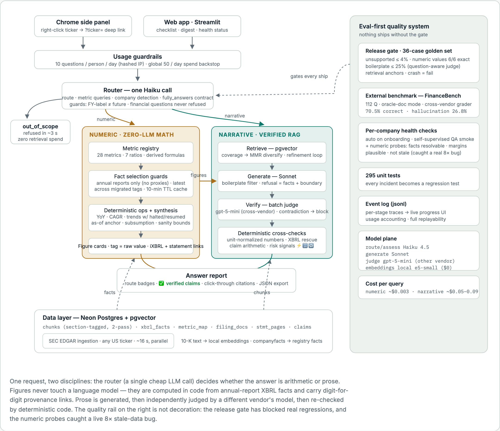

# FinSignal — SEC Filings Q&A You Can Check

Ask any US public company's 10-K, in any language. **Every number is computed
from official SEC XBRL data by deterministic code — never written by an LLM —
and carries a digit-for-digit provenance link. Every written claim is
independently verified against the filing** by a cross-vendor judge, with
click-through citations; contradicted claims are structurally unable to reach
the screen.

**[Live demo](https://jfu06-finsignal-backenduiapp-lbq2kk.streamlit.app/)** ·
**[Chrome extension](https://chromewebstore.google.com/detail/finsignal-%E2%80%94-sec-filings-q/mmddjhihmkgjingnkaneofhhkbepcbih)**
(Web Store) · [Lessons learned](LESSONS.md) from building this with an
eval-first loop.



*Figures never touch a language model; prose never grades its own work; nothing ships without the gate. (ASCII version: [docs/architecture.txt](docs/architecture.txt))*

---

## Why trust is architectural here

Three separations, each enforced in code rather than promised in a prompt:

1. **Numbers ≠ language.** A figure is never generated: it is selected from
   official XBRL facts (annual reports only — proxy statements never vote)
   and computed by tested Python. The provenance line under every card
   prints the exact concept and full-precision value
   (`us-gaap:Revenues = 23,921,000,000`) with links to the SEC iXBRL viewer
   and the rendered statement page — the reader matches the digits.
2. **Writer ≠ judge.** Claims are verified by a *different vendor's* model
   (Claude writes, GPT judges), then re-checked by deterministic code
   (unit-normalized figure matching, claim-internal arithmetic, XBRL
   rescue). A contradicted claim is blocked before render.
3. **Shipping ≠ hoping.** The release gate (below) blocks any change that
   regresses faithfulness, numeric correctness, or informativeness. It has
   blocked real regressions; that is its job.

When neither line can answer honestly — a judgment question, a metric that
doesn't exist for the company, a transient failure — the system says exactly
that, with the facts it does have. An unverifiable answer never renders.

### Credibility mapping

| Judge verdict     | Status  | Behavior                                                       |
|-------------------|---------|----------------------------------------------------------------|
| `SUPPORTED`       | OK      | Shown normally with a clickable citation                       |
| `NOT_ENOUGH_INFO` | WARNING | Shown but marked **unverified**, behind an acknowledgment gate |
| `CONTRADICTED`    | ERROR   | **Blocked** (never shown); triggers one regeneration           |

---

## Evaluation

**Release gate** — `python -m eval.run_eval` exits non-zero (do not ship) on
any of: unsupported rate > 4%, any of the 6 pinned numeric answers wrong,
boilerplate rate > 25% (question-aware informativeness judge), a crashed
case. The golden set has **36 cases: 25 narrative (with retrieval anchors) ·
6 numeric (exact values + accessions pinned) · 5 numeric-boundary**.

**External benchmark** —
[FinanceBench](https://arxiv.org/abs/2311.11944) 10-K subset: 112
expert-annotated questions over 64 historical 10-Ks from 31 companies, run in
oracle-document mode with `corpus='benchmark'` isolation (benchmark filings
can never leak into live retrieval). Graded against expert answers by a
cross-vendor LLM grader: **70.5% correct**, with honest abstentions counted
separately from hallucinations. A capability score that feeds the roadmap —
deliberately *not* part of the gate.

**Per-company health checks** — every onboarded ticker automatically gets a
self-supervised QA smoke eval plus deterministic numeric probes (facts
resolvable, same-year margins plausible in both scale-pollution directions,
latest annual not stale). The probes caught a real stale-tag bug that shipped
a four-year-old "latest revenue" — on their first run.

**295 unit tests.** Every production incident becomes a permanent regression
test.

---

## Project layout

```
backend/
  app/
    config.py         # env-driven config (models, thresholds, guardrails)
    logging_utils.py  # log_event(): one jsonl line per step
    models.py         # Chunk / Claim / TestCase + Verdict→Status mapping
    db.py             # Neon connection (pgvector) + schema init
    schema.sql        # DDL: chunks / claims / xbrl_facts / filing_docs / …
    embeddings.py     # local e5 embeddings (query:/passage: prefixes)
    chunking.py       # section-tagged 2-pass chunking (bare-heading fallback)
    ingest.py         # chunk + embed + store
    retrieval.py      # pgvector top-k + MMR diversification (coverage mode)
    refinement.py     # bounded agentic retrieval-refinement loop
    router.py         # route + numeric query planning/execution + guards
    xbrl.py           # metric registry + SEC companyfacts ingestion
    metrics.py        # fact selection (forms filter, tag migration, cache),
                      #   ratios, derived formulas, provenance links
    schemas.py        # Pydantic models with lenient salvage validators
    generation.py     # structured claims (attribution shape, refusal shape)
    verification.py   # ONE cross-vendor batch judge call per report
    span_overlap.py   # unit-normalized figure match · arithmetic self-check
    risk_signals.py   # materiality badges: quantified / realized / echoed
    boilerplate.py    # question-aware informativeness judge (eval axis)
    assembler.py      # report + credibility mapping
    pipeline.py       # LangGraph StateGraph orchestration
    digest.py         # one-click annual report digest (4 parallel sections)
    edgar.py          # SEC EDGAR client (any US ticker)
    onboarding.py     # on-demand onboarding (~16 s, ingest ∥ facts)
    smoke_eval.py     # per-company health check (QA smoke + numeric probes)
    usage.py          # per-visitor + global budget accounting
  ui/app.py           # Streamlit demo UI — intentionally monolithic (~950
                      #   lines): a single-file demo surface, not the product
                      #   architecture; all logic lives in app/
  eval/               # golden set · release gate · FinanceBench harness
  tests/              # 295 unit tests
  data/raw/           # 10-K text (not committed) + health-check results
docs/                 # design-doc, requirements, decisions, data-dictionary
```

---

## Setup

### 1. Python environment

```bash
cd backend
python3 -m venv .venv
source .venv/bin/activate
pip install -r requirements.txt
```

### 2. Configure secrets

```bash
cp .env.example .env
# edit .env: set DATABASE_URL, ANTHROPIC_API_KEY (and OPENAI_API_KEY for the judge)
```

`.env` is git-ignored; no secret is ever hard-coded or committed.

- **Generation:** Anthropic Claude · **Judge:** OpenAI (cross-vendor by design)
- **Embeddings:** local sentence-transformers
  (`intfloat/multilingual-e5-small`, 384-dim, both-side prefixes applied
  automatically) — multilingual, so questions may be in any language while
  the corpus is English. Answers are always English.

### 3. Provision Neon (pgvector)

Create a free Postgres database at [neon.tech](https://neon.tech), then:

```bash
python -m app.db          # applies backend/app/schema.sql against DATABASE_URL
```

The canonical DDL lives in [`backend/app/schema.sql`](backend/app/schema.sql).

---

## Usage

```bash
cd backend && source .venv/bin/activate

python -m app.db                        # one-time: apply schema
python -m scripts.download_filings      # fetch seed 10-Ks from EDGAR
python -m app.ingest                    # chunk + embed + store

# ask a question (any language; answers are English)
python -m app.pipeline "What was Apple's FY2025 revenue and how fast is it growing?" AAPL

# web UI
streamlit run ui/app.py

# release gate (exits non-zero on any threshold breach — do not ship)
python -m eval.run_eval

# FinanceBench external benchmark
python -m eval.ingest_benchmark          # one-time: fetch 64 historical 10-Ks
python -m eval.ingest_benchmark_facts    # registry-filtered XBRL backfill
python -m eval.run_benchmark             # 112 questions, graded report
```

---

## Deploying publicly

All config is env-driven — set `DATABASE_URL` and the API keys as platform
secrets. Streamlit Community Cloud: main file `backend/ui/app.py`, Python
3.11. Cost guardrails:

| Env var | Effect |
|---|---|
| `ACCESS_CODE` | Non-empty → UI requires this code |
| `VISITOR_DAILY_LIMIT` | Questions per person per UTC day, hashed-IP (default 10) |
| `DAILY_QUERY_BUDGET` | Global questions per UTC day — spend backstop (default 50) |
| `MAX_TICKERS` | Corpus cap for on-demand onboarding (0 = unlimited) |

Also set a monthly spend limit on the LLM keys (hard backstop). Note for
Streamlit Cloud: changes under `backend/app/` require an app **Reboot** —
hot reload only re-runs the UI script, and stale module caches have shipped
real incidents.

## Tests

```bash
cd backend && pytest        # 295 tests
```

## Lessons learned

Building this with an AI pair, eval-first, surfaced a set of failure modes
worth reading before trusting any LLM system with numbers:
**[LESSONS.md](LESSONS.md)**.
