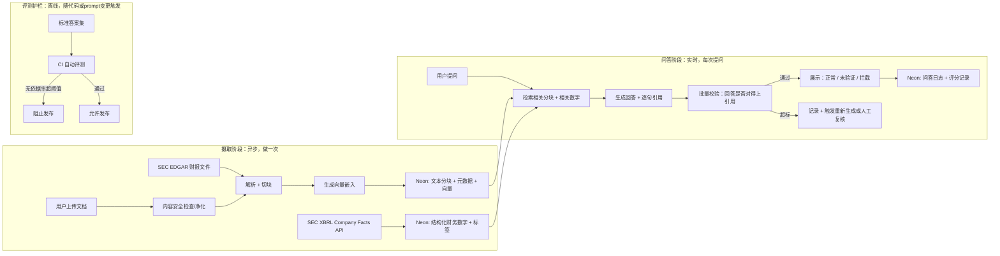

# FinSignal — 决策记录（Decisions Log）

> 本文档持续记录项目推进过程中的关键决策、依据和权衡，是后续撰写交付物"反思文档"的原始素材。客户原始需求见 [requirements.md](./requirements.md)，工程侧需求拆解见 [project-requirements.md](./project-requirements.md)，本文件不重复前两者内容。

## 系统架构总览

核心思路是把"摄取"和"问答"拆成两个独立阶段：摄取只做一次（异步/离线），问答阶段只对已经建好索引的数据做检索和生成（实时）。评测护栏作为第三条线，跟着代码/prompt 变更触发。

## 关键决策记录

| 决策点 | 我们的选择 | 为什么 | 状态 |
|---|---|---|---|
| 数字类数据来源 | 直接用 SEC 官方免费 XBRL Company Facts API，不自建解析器、不购买第三方标准化数据集 | 免费、天然带申报标签，可追溯到具体字段，避免"引用不等于验证数字"这个坑；成本和时间都最省 | 已决定 |
| 叙述类数据处理 | 文档切块 + 向量嵌入，存入 Neon（pgvector 扩展），检索式问答（RAG） | 财报叙述部分是非结构化文本，适合语义检索而非计算；复用同一个 Postgres，不必额外接向量数据库 | 已决定 |
| claim 颗粒度与校验方式 | 两步走：先生成带引用的回答，再用一次批量校验，检查回答内容与引用是否对应 | 比逐句或逐原子问题多次调用模型更省钱省时间，同时保住引用可信度这个核心卖点 | 已决定 |
| 实时护栏 | 复用批量校验这一步的结果，对无依据/矛盾结论做展示降级或直接拦截 | 不单独训练或接入额外校验模型，控制成本 | 已决定 |
| 离线评测护栏 | 手工攒 30–50 条标准答案题，接入 CI，每次改动 prompt 或模型自动跑一遍 | 覆盖"该拒答""该反问""正常能答"三类场景；先做小而够用的版本，后续随真实数据扩充 | 已决定，持续扩充 |
| 用户上传文档的信任级别 | 复用两层护栏：规则层拦截明显的注入指令；系统提示词用分隔符把文档内容标注为"数据非指令"。上传文档默认可信度基线低于官方来源 | 已有真实案例显示隐藏文字可操纵模型输出，但完全禁止上传不现实（需求里明确要支持） | 已决定 |
| 时间口径默认值 | 用户没指定时间时，默认取最新一期，并在回答里明确写出用的是哪一期 | 零额外交互成本，同时保持对用户透明 | 已决定 |
| 幻觉判定边界（WARNING vs ERROR） | 先用 prompt + 标注示例迭代打磨，不追求算法层面的精确边界 | 目前没有能做到近乎完美判断的公开方案，工程投入产出比更适合放在"未经证实"状态的体验设计上 | 已决定，持续迭代 |
| 监管合规定位 | 详见 project-requirements.md 的假设方案 | — | 假设，待客户/法务确认 |
| 标准答案集长期维护责任 | 详见 project-requirements.md 的假设方案 | — | 假设，待客户/法务确认 |
| 无依据结论率阈值是否分文档类型 | 详见 project-requirements.md 的假设方案 | — | 假设，待客户/法务确认 |

## 市场调研摘要（该抄什么、不该抄什么）

调研对象：Hebbia（机构向，逐条引用 + 表格化原子答案）、FinChat/Fiscal.ai（散户向，标准化数据集 + AI 问答）、GeminIQ（对标 Fiscal.ai 的第三方评测，强调 XBRL 标签级溯源）、dotnitron（PE 工作流自动化，低置信度人工复核模式）、以及一篇关于上传 PDF 隐藏文字操纵模型的安全案例。

核心结论：数字类结论和叙述类结论要分开处理，数字要能机械追溯到申报字段，不能只满足于"引用了这份文件"；claim 校验适合拆成"生成 + 批量校验"两步而不是逐句单独调用模型；护栏要分实时（单次输出拦截）和离线（版本发布门槛）两层，阈值不能混用；用户上传的文档默认可信度要低于官方来源，且必须过内容安全检查。详细分析过程见对话记录，此处不重复展开。

## 待办 / 下一步

- [ ] 补充标准答案题库（当前目标 30–50 条，覆盖正常/拒答/反问三类）
- [ ] 和客户/法务确认三条假设（合规定位、测试集维护、阈值分档）
- [ ] 验证 SEC XBRL Company Facts API 覆盖率是否满足 Sample Data 里的 AAPL 场景
- [ ] 设计上传文档的内容安全检查具体规则
